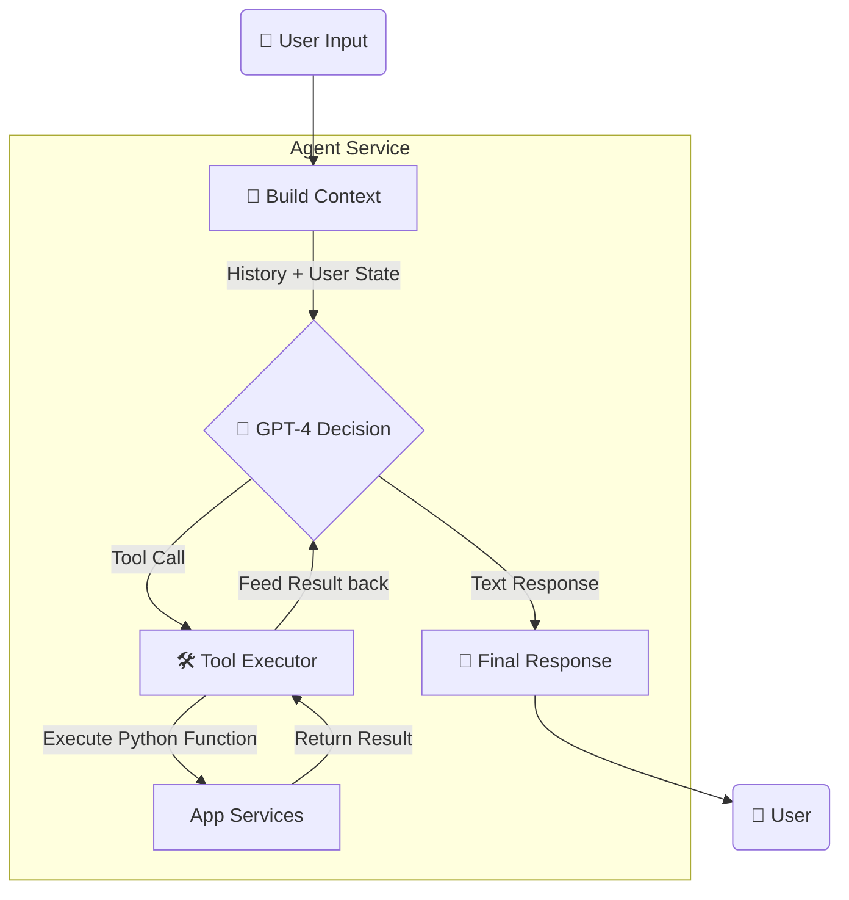

# 🤖 AI Agent Architecture

## Overview
The **IAM Agent** is an autonomous system built on **OpenAI GPT-4**. It goes beyond simple "Chat" by having `Write Access` to the user's data. It acts as a **Coach**, proactively managing tasks, goals, and providing guidance.

## 🧠 The "Brain" (Controller Logic)
The agent operates on a **Observe-Orient-Decide-Act (OODA)** loop, powered by OpenAI's `Function Calling` API.

### Agent Loop Diagram



---

## 🛠️ Tool Definition Strategy
Tools are Python functions decorated and registered in the `FunctionRegistry`.

### Implementation Pattern
```python
@agent.register_tool(
    name="create_mind_task",
    description="Schedule a new mental wellness task"
)
def create_mind_task(user_id, task_type, time):
    # 1. Validate input
    # 2. Call TaskService
    # 3. Return JSON result to Agent
    return {"status": "success", "task_id": "..."} 
```

### Key Tools Available
| Tool Name | Purpose | Params |
|-----------|---------|--------|
| `get_tasks` | List pending tasks. | `status`, `limit` |
| `create_task` | **Action**: Create new entry. | `template_key`, `date` |
| `update_goal` | **Action**: Change goal targets. | `goal_id`, `new_target` |
| `get_stats` | Analysis: Check user XP/Level. | `user_id` |

---

## 📝 Prompt Engineering
The agent uses a dynamic System Prompt that injects real-time context.

**Template Structure:**
> "You are an expert Lifestyle Coach. Your goal is to help the user balance Mind and Body."
>
> **Current Context:**
> - User Name: {name}
> - Current Time: {time}
> - Pending Tasks: {count}
>
> **Rules:**
> 1. Be concise and motivational.
> 2. Always check existing tasks before creating new ones.
> 3. Use tools whenever the user implies an action (e.g., "I need to meditate").

---

## 🔗 Integration Points
The Agent integrates into the standard API architecture:

1.  **Chat Interface**: 
    - Dedicated endpoint `POST /api/chat/sessions/...`.
    - Returns structured `User` vs `Assistant` messages.

2.  **Autonomous Recommendations** *(Planned)*:
    - Cron jobs trigger the agent to review User Data (`get_stats`) and proactively send messages or create tasks if the user is inactive.
