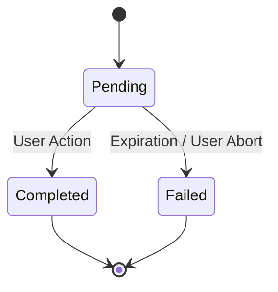

# 📖 API Reference Guide

## 🔖 Introduction
This API follows **RESTful** principles. It uses standard HTTP response codes, authentication, and verbs.

- **Base URL**: `http://localhost:5000/api`
- **Authentication**: Bearer Token (JWT) required via `Authorization` header.
- **Content-Type**: `application/json`

---

## 🔐 Auth & Profile
Core endpoints for user identity and personalization.

### Authentication
| Method | Endpoint | Description | Auth Required |
|:------:|----------|-------------|:-------------:|
| `POST` | `/login` | Authenticate user (Email/Password) and get JWT. | ❌ |
| `GET` | `/getusers` | **[DEV]** List all users for testing. | ❌ |

### User Profile (`/api/profile`)
| Method | Endpoint | Description |
|:------:|----------|-------------|
| `GET` | `/` | Retrieve the authenticated user's detailed profile. |
| `POST` | `/` | Initialize profile settings. |
| `PUT` | `/` | Update settings (timezone, preferences, physical stats). |
| `DELETE`| `/` | Delete profile data. |

---

## 🧠 Mind & Body Tasks
The core of the "IAM" philosophy. Tasks are split into two domains.

### Mind Tasks (`/api/tasks/mind`) & Body Tasks (`/api/tasks/body`)
*Replace `mind` or `body` in the URL.*

| Method | Endpoint | Description |
|:------:|----------|-------------|
| `GET` | `/` | List tasks. Params: `status=pending`, `limit=10`. |
| `GET` | `/<uuid>` | Get detailed view of a single task. |
| `POST` | `/` | Create a new task manually. |
| `POST` | `/<uuid>/complete` | **Mark as Completed**. Triggers XP gain. |
| `PUT` | `/<uuid>` | Update task details (e.g., reschedule). |
| `DELETE`| `/<uuid>` | Remove a task. |

#### Task Lifecycle Diagram


### Task Templates (`/api/task-templates`)
Blueprints for creating consistent tasks.

- `GET /` : List all templates.
- `GET /category/<cat>` : Filter by `mind` or `body`.
- `GET /key/<unique_key>` : Get specific template (e.g., `morning_meditation`).
- `POST /` : **[Admin]** Create new template.

---

## 🤖 AI Coaching & Chat
Interact with the intelligent agent.

### Chat Sessions (`/api/chat`)
- `GET /sessions` : history of conversations.
- `POST /sessions` : Start a new thread.

### Messages
- `GET /sessions/<id>/messages` : Full transcript.
- `POST /sessions/<id>/messages` : **Send Prompt**. Returns including User + Artificial response.

### Recommendations (`/api/recommendations`)
- `GET /mind` : AI-suggested mental tasks based on recent logs.
- `GET /body` : AI-suggested physical tasks.

---

## 🏆 Gamification
Engagement mechanics.

### Goals (`/api/goals`)
Long-term objectives (e.g., "Hit 80kg weight").
- `GET /`, `POST /`, `PUT /<id>`, `DELETE /<id>`

### Achievements (`/api/achievements`)
Badges and milestones unlocked.
- `GET /` : List unlocked achievements.

---

## ⚙️ System & Automation

### Bot Rules (`/api/bot-rules`)
User-defined or system-defined automation rules (e.g., "If Monday 8AM, create Goal Setting task").
- `GET /`, `POST /`, `PUT /`, `DELETE /`

### Statistics (`/api/stats`)
- `GET /` : General user statistics (XP, Level, Tasks Completed).

### Failures (`/api/failures`)
Track why tasks were not completed.
- `GET /`, `POST /`

---

## 🧪 JSON Schema Examples

### **Create Task Payload**
```json
{
  "template_id": "550e8400-e29b-41d4-a716-446655440000",
  "scheduled_at": "2025-11-20T08:00:00Z",
  "params": {
    "duration_minutes": 15,
    "intensity": "medium"
  }
}
```

### **Chat Response**
```json
{
  "user_message": { "role": "user", "content": "Help me focus" },
  "assistant_message": { 
    "role": "assistant", 
    "content": "I recommend a 5-minute breathing exercise. Shall I schedule it?",
    "tool_calls": [] 
  }
}
```
