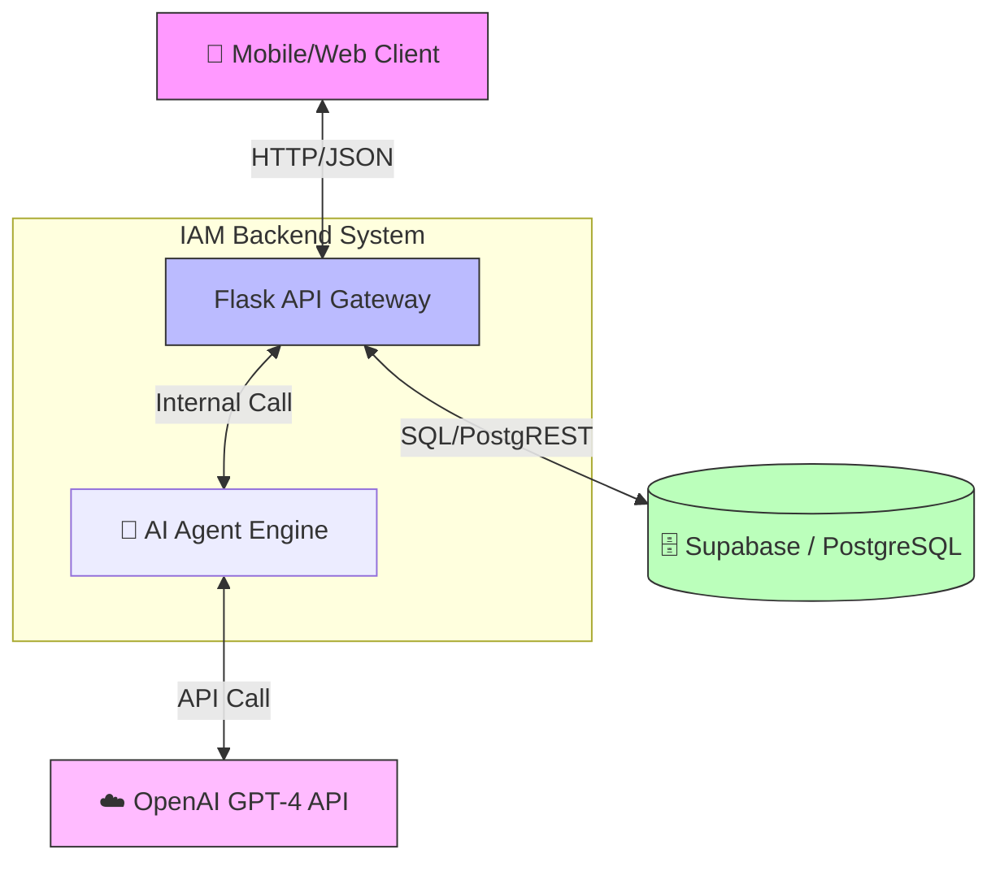
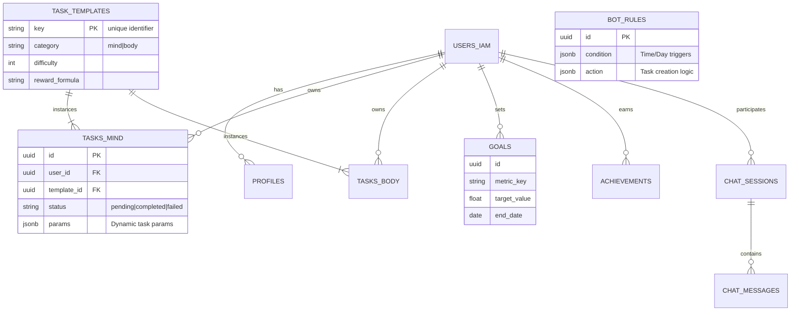
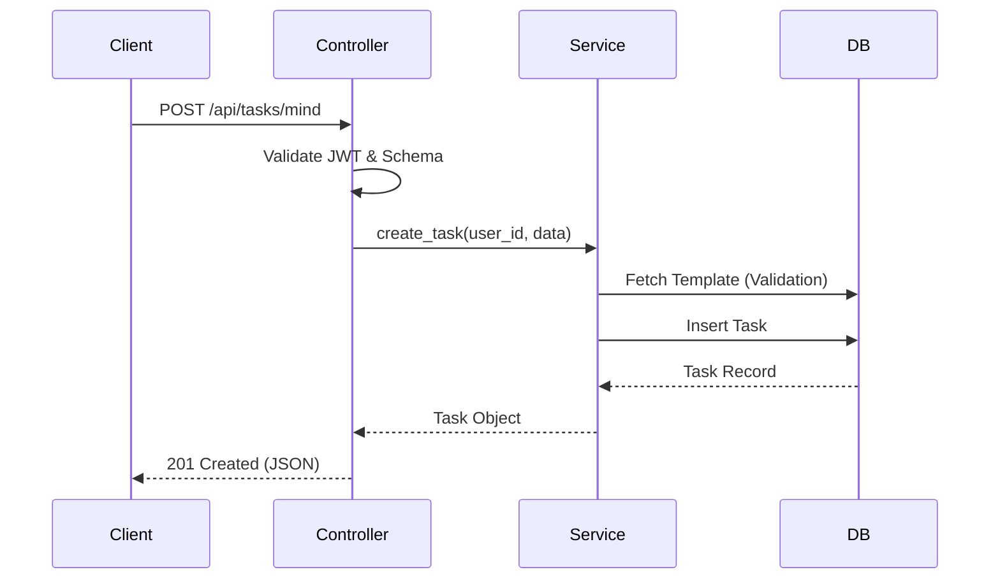
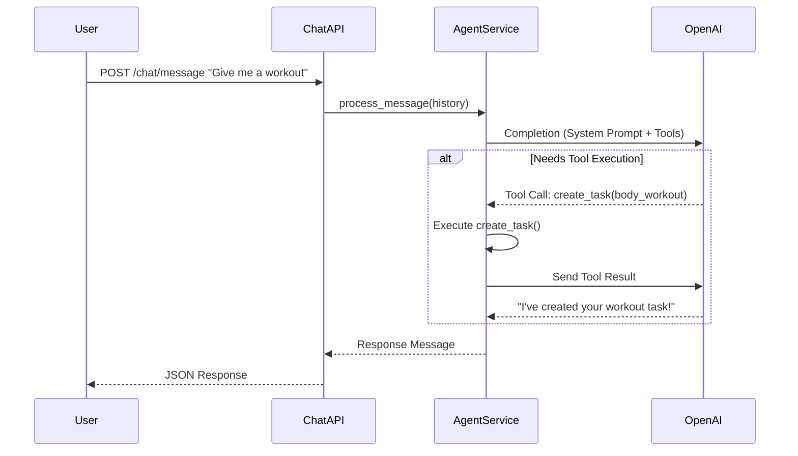

# 🏗️ System Architecture

## Overview
The **IAM Backend** is a monolithic Flask application designed with a **Layered Architecture** pattern. It serves as the central nervous system for a wellness and productivity platform, orchestrating data between the User, the Database (Supabase), and external AI Services (OpenAI).

## 🧩 Architectural Patterns
- **Layered Architecture**: Separation of concerns into Routes, Controllers, Services, and Models.
- **Repository Pattern (Implicit)**: Direct Supabase calls within the Service/Model layer act as the data access layer.
- **Micro-Kernel (Plugins)**: The AI Agent system acts as a pluggable component that can "drive" the application via function calling.

---

## 🖼️ System Context Diagram (C4 Level 1)
High-level view of how the system interacts with external actors.



---

## 📦 Container Diagram (C4 Level 2)
Detailed look at the application structure.

```mermaid
graph TB
    subgraph "Flask Application"
        direction TB
        
        Routes[📡 Routes / Blueprints]
        Controllers[🎮 Controllers]
        Services[⚙️ Services (Business Logic)]
        Models[📦 Data Models / Access]
        
        Routes --> Controllers
        Controllers --> Services
        Services --> Models
        
        subgraph "Cross-Cutting Concerns"
            Auth[🔐 JWT Auth Middleware]
            Utils[🛠️ Utilities / Helpers]
        end
    end
    
    Services --> Agent[🧠 Agent Service]
    
    click Routes "http://localhost:5000/api"
```

### Component Description

1.  **Routes (`/routes`)**: 
    - Entry points defining URL patterns.
    - Responsible for **routing** only. Delegates processing to Controllers.
    - Example: `auth_routes.py`, `mind_task_routes.py`.

2.  **Controllers (`/controllers`)**:
    - **Input Validation**: Ensures request data is correct (headers, body, params).
    - **HTTP Response**: Formats success/error JSON standard responses.
    - **Orchestration**: Calls one or more Services.
    - Example: `TaskController.create_task()`.

3.  **Services (`/services`)**:
    - **Business Logic**: The "Brain" of the application.
    - **Rules Enforcement**: e.g., "User cannot have two active tasks of the same type".
    - **Agent Integration**: Decides when to involve AI.
    - Example: `TaskService`, `AgentService`.

4.  **Data Layer (`/models` & `lib/db.py`)**:
    - **Supabase Client**: Direct interaction with the database.
    - **Schema Definitions**: Pydantic models or Python classes representing DB tables.

---

## 🗃️ Database Schema (ERD)
The system uses **PostgreSQL** (via Supabase). Below is the logical data model.



---

## 🔄 Core Workflows

### 1. Task Creation Flow


### 2. AI Agent Interaction Flow

